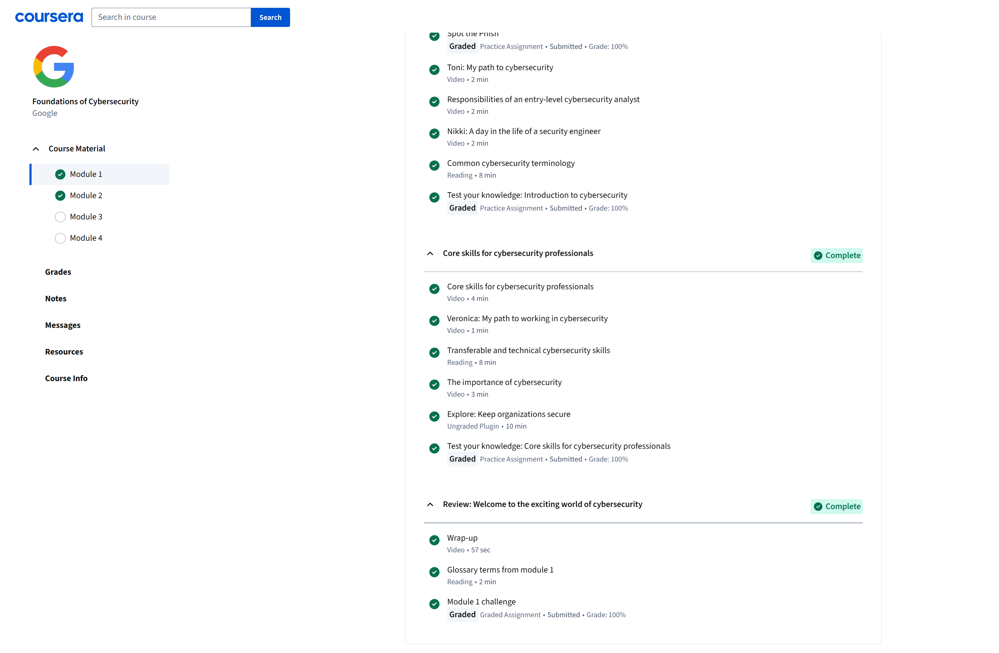

# Google Certificate Module 1: Foundations of Cybersecurity 

## Date of Completion: Sept 2, 2025

### What I Learned in This Module
- In this first module for this course, they introduced the essential and fundamental concepts of cybersecurity and showed why protecting information in a digital environment can create significant value. They uncovered how professionals are detecting and preventing threats at work, and how to maintain a good relationship between the organization they work for. This lesson also included future roles that are related to this course and how they perfectly function and work together to defend networks.

### Key Takeways
- Throughout the module, I get to explore how cybersecurity fields will access different technologies for problem-solving and mark the significance of great responsibilities be applied to the cybersecurity team member and workers. I then get in touch with cybersecurity fundamentals, like identifying threats and managing risk, but at the same time, I need to understand how data breaches can also occur, and it can be difficult since there are thousands of different scenarios to cover. This module also mentioned the importance of ethics because it proved that strong communication and defense strategies heavily rely on the great use of ethics.
- Important highlights:
- This course help me better granting good understanding on some of the most fundamental on the cybersecurity frameworks.
- I've also learned how cybersecurity always focus their intension on teamworks and communcation, such as helping professionals make faster and accurate decisions.

### Skills helps me improved
- This module about the fundamentals of cybersecurity greatly strengthened my focus and analytical mindset because it taught me the ability to approach difficult technical challenges more methodically. Thus, it helped gain more confidence when I explained the security concept I learned and how I will be applying it in future protection scenarios.

### My personal reflections
- The completion of module 1 granted me a new understanding of my future cybersecurity journey, by showing me step-by-step activities and speeches that will strengthen my skills to protect information that will require both technical skills and self-awareness. During the learning of this course, it deeply inspired me to continue and develop my skills in scripting, network communication, and protecting data in the future as a cybersecurity operator.

## Screenshot

