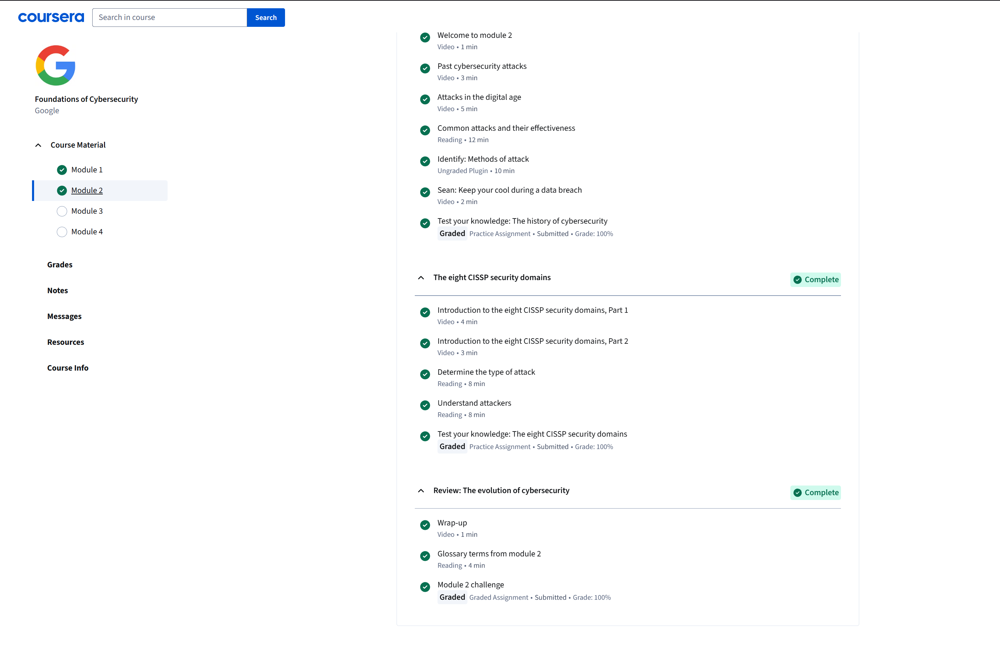

# Module 2: The Evolution of Cybersecurity
## Completed: Sept 3, 2025

### Overview
-In this module, I discovered that many attacks and threats can be created by threat actors, such as Social Engineering and Phishing. 
 These two attacks affecting me the most are how easily people could inadvertently expose themselves to threat actors. 
 We can easily be manipulated to fall into traps such as Social Proof Manipulation that secretly lure peoples subconscious mind to think this is trusted-
 and are in used by many others.

### Steps I Took
-Learned about the evolution of cybersecurity and how attacks are changed over time.
-Studied real-world breaches and mistakes that caused those crises.
-Explore how social engineering and phishing are still among the most effective attacks.

### What I learned
- Social engineering tricks
- Phishing attacks can exploit both technical gaps and human weaknesses.
- Threat actors are adapting to new technology over time, so defenses must keep evolving as such.

### Reflection
This module brings me the real-world problems and disasters that are created among the cyber world and how effective 
those attacks and mistakes can impact very in populations. This can greatly motivate me to master both technical defense and 
awareness throughout training and reviewing.

### Screenshot

