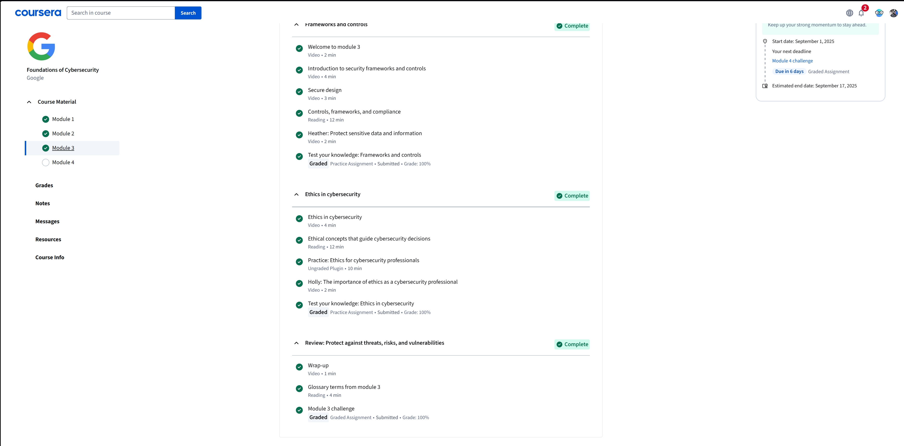

# Module 3: Protect against threats, risks, and vulnerabilities
## Completed: Sept 11, 2025

### Objective 
- Learn about security frameworks and controls of used in the organization.
- Understand the role of ethics in guiding cybersecurity decisions.

### Key Points Learned 
- Security frameworks (NIST, ISO) provide structured guidelines for protecting the system.
- Security controls (administrative, technical, and physical) help reduce risks and protect datas.
- Ethics is essential in cybersecurity decisions (responsible disclosure, protecting users, and avoiding harm).
- Compliance is tied to frameworks such as keeping the organization secure and avoiding legal penalties.

### Skills Gained 
- Explain differences between frameworks and controls.
- Identify common compliance requirements and why they matter.
- Recognize ethical responsibilities as a cybersecurity professional.
- Connect risk management to the real-world business impact.

## Screenshot

