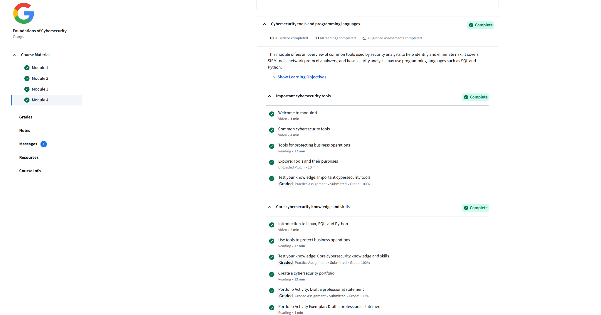

# Module 4 - Cybersecurity Tools and Programming Languages. 
## Completed: Sept 17, 2025

### Objective
- Learned about how common cybersecurity tools are used by professionals to detect and reduce risk.
- Understood how programming languages like SQL and Python can greatly support security tasks.

### Key Points Learned
- SIEM tools (Security Information and Event Management) can help track and analyze security events.
- A  network protocol analyzer can capture and study traffic for suspicious activity.
- SQL is very useful for querying databases to detect anomalies.
- Python is powerful when it comes to automating security tasks and writing scripts.
- Drafting a cybersecurity portfolio can show my growth and practical skills over time.

### Skills Gained
- Ability to identify important cybersecurity tools and their uses.
- Applying knowledge of Linux, SQL, and Python to security work.
- Building a great professional portfolio to present to employers.
- Understanding how to use technical tools to protect business operations.

### Screenshot

