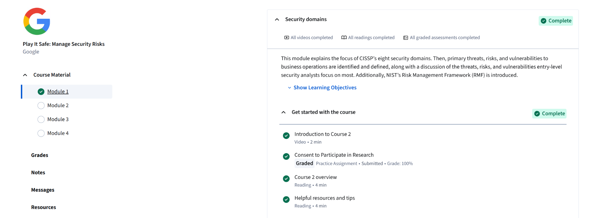

# Module 1 - Security Domains
## Completed: Oct 4, 2025

### Objective
- This module introduced me to a new set of security fields called the CISSP's eight security domains. This module gave an overview of how
threats, risks, and vulnerabilitys can greatly affect business operations. It also provides a glance at the NIST Risk Management Framework(RMF),
which is widely used to manage cybersecurity risks in organizations.

### Key Points Learned
- CISSP's Eight Security Domains: These are domains that outline the main areas of cybersecurity, thus helping professionals
  to organize their knowledge and focus their work on different aspects of security.
- Threats, Risks, and Vulnerability: I learned how these three elements interact and understand why they are essential for protecting business operations.
- Entry-Level Analyst Focus: This module highlighted the importance of the concept of threat and vulnerability, showing why they are
  most relevant for entry-level cybersecurity roles, therefore giving me a clear sense of real-world priorities.
- NIST RMF Introduction: I was introduced to the beginning of the NIST Risk Management Framework system. This is a well-structured approach that organizations can
  used to identify, assess, and respond to security risks systemically.

### Skills Gained
- I gained a foundational understanding of the eight domains of cybersecurity.
- Learned the ability to distinguish between threats, vulnerabilities, and risks.
- Developed sensational awareness of what entry-level analysts are expected to focus on in real-world environments.
- Understood the basics of applying risk management frameworks using concepts like NIST RMF.

### Reflection 
- This module leans towards introductory to the cybersecurity field, but it gave me a big-picture view of how cybersecurity
  are structured and maintained in professional environments. Learning the CISSP domains early can help me understand where each tool, technique,
  and skill could be applied in a bigger framework. The introduction to NIST RMF also showed me a peek at how structured cybersecurity work
  really is, as it is not just about tools, but also about organized processes and frameworks.

