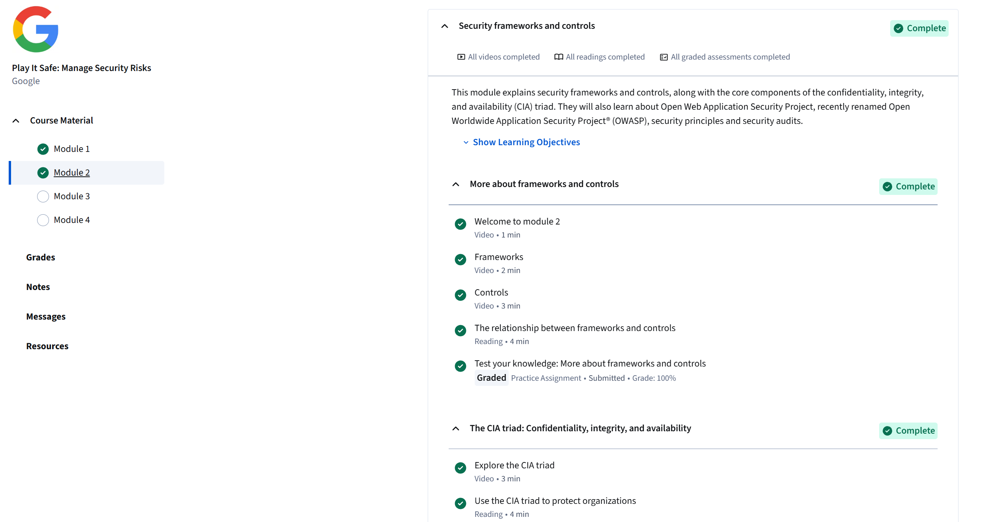

# Module 2: Security Frameworks and Controls
## Completed: Oct 10, 2025

### Objective In This Course
During this module, I understand how cybersecurity frameworks and controls can create a structured approach to protect valuable information system.
I also get a better understanding of the CIA triad once again, and how frameworks like NIST and OWASP will perfectly guide professionals in identifying risks and managing them.

# Key Point I Learned
- Security Frameworks: Frameworks like NIST and ISO provide well-structured guidelines for organizations to greatly manage and reduce any future cybersecurity risks more effectively.
- Controls: Security controls such as administrative, technical, and physical will be perfect defense mechanisms when it comes to protecting data and systems from any malicious threat.
- CIA Triad: The CIA triad plays a huge role in the cybersecurity field as a foundational principle to ensure data will remain confidential, accurate, and available for only authorized users.
- OWASP: OWASP stands for the Open Web Application Security Project. This concept principally focuses on identifying and reducing vulnerabilities in web applications, and dramatically helps security teams to stay proactive against serious attacks.

# Skills That I Obtained
- Gained great learning on aligning security practices with well-established frameworks and standards.
- I've acquired throughout understanding of how security controls protect data and how they ensure great system reliability.
- This course greatly strengthened my knowledge of the concept of CIA triad and its real-world applications.
- Building awareness of how the OWASP guide organization can add the overwhelming power of defenses when it comes to ensuring web application safety.

# Personal Reflection
The learning with module 2 helped me greatly to get in touch with cybersecurity frameworks, and presented to me how cybersecurity frameworks will connect to real-world protection. 
During my time with this course, I greatly developed knowledge about the CIA triad again, and it made me realize that security doesn't solely rely on preventing attacks but also on keeping information accurate, private, and available.
Overall, better awareness of frameworks like the NIST and OWASP shows me that even elite professionals will rely on a basic foundation guide to stay consistent in their work and reduce any potential risk across organizations.

