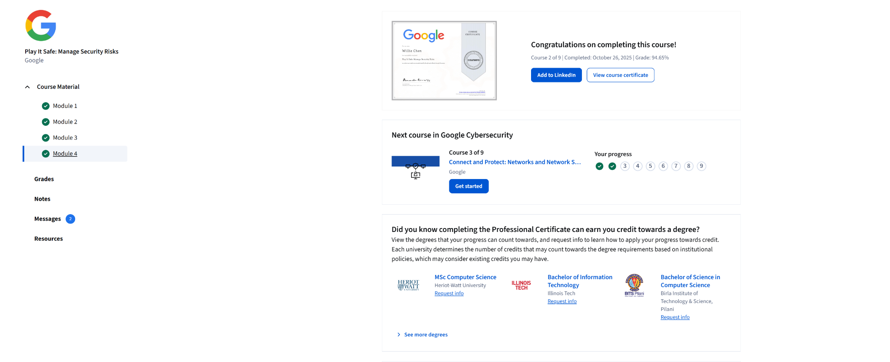

# Google Cybersecurity Professional Certificate
# Play It Safe: Manage Security Risks – Module 4: Use Playbooks to Respond to Incidents
# Completion Date: Oct 26, 2025

# Overview of this chapter 
- The overall of this module highlighted the significant use of playbooks, showing how it is perfectly performed by cybersecurity teams. The security teams can use the incident response playbooks to prevent threats, vulnerabilities, and risks, thus explaining the importance of the playbook. Playbooks are important, but they cannot survive without the help of other security tools, such as the SIEM tools and SOAR system, that can advocate the progress and accuracy when it comes to supporting analysts during investigations. Like all the other lessons, this module also covered real-world examples and challenges that will let me personally gain a better understanding of responding to alerts and a step-by-step tutorial on the use of playbooks.

# The Key Learning of Module 4
- The main concept of module 4 is the introduction of the incident response playbook, because the playbook covers a significant role from identifying suspicious activity to storing the issues, and finally, to prevent any future incidents. This shows how various perspectives on playbooks can offer great improvement to the security team in handling incidents and benefiting their decision-making.

- Key takeaways:
- Playbook can act as a roadmap to guide analysts during security events.
- The addition of SIEM tools and SOAR systems can act as a catalyst when using the playbook because it will speed up efficiency and provide more accuracy during the investigations.

# Skills and Development I Gained In Module 4
- During the lesson with module 4, I learned the ability to interpret alerts with the help of playbook and how playbook can guide my actions and decide what the most ideal step for me to take next when encountering security issues. This course also strengthened my learning and usage of SIEM tools that I've been taught in module 3 by providing more hands-on practice on how to respond to SIEM alerts. Hence, I believe these resourceful skills can tremendously boost my confidence and ability to respond to real security events in the future.

# Reflection 
- This module helps me understand how the usage of playbook can help security teams to stay organized and effective, especially when time and space are limited. This made me realize how even an elite member of a security team will rely on guidance or a well-structured path to continue their work, thus motivating me to prepare myself like them for real-world security operation work in the future.

