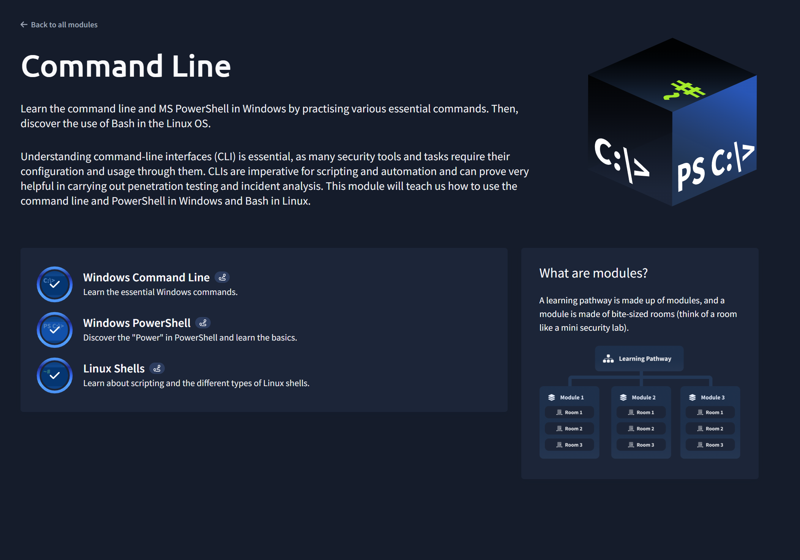

# Command Line 

## Completed: Oct 17, 2025

### Overview of Command Line
- The Command Line module provided me an essential introduction about the command-line interfaces that are applied in both Windows and Linux environments. Topics and main ideas they mentioned include the Windows Command Line, PowerShell, and Linux bash. These three core concepts of the module can greatly help professionals to navigate the system and manage files more quickly and precisely. I believe the main objective of this course is to help me establish a fundamental understanding of usage in terminal-based operation when it comes to cybersecurity work.

### Key Aspects From Command Line
- There are three key learnings from this course. The Window Command Line, PowerShell, and Linux Bash. First, let's talk about the Windows Command Line. The Windows command line is built for covering navigation and handling file operations. While PowerShell introduces powerful tools like the cmdlets with scripting methods to precisely automate tasks and retrieve data. Finally, the Linux Bash covers utilities like directory, permission handling, and the use of text-processing.
- The Command Line interface should be treated as a fundamental tool as it should be because it provides general automation and basic system functionality.
- It is also important to master both Windows and Linux environments because they may share the same concepts when working with, but they have significant differences in syntax, structure, and functionality.

### Skills and Development I gained
- Completion of this module significantly improves my development in technical accuracy, speed, and adaptability when it comes to using these critical skills in the workforce in my future. There is much precious knowledge I learned during this course, such as the ability to perform operations without any graphical tools and be able to apply scripting features when I am working with tasks in the cybersecurity field and administrative tasks.

