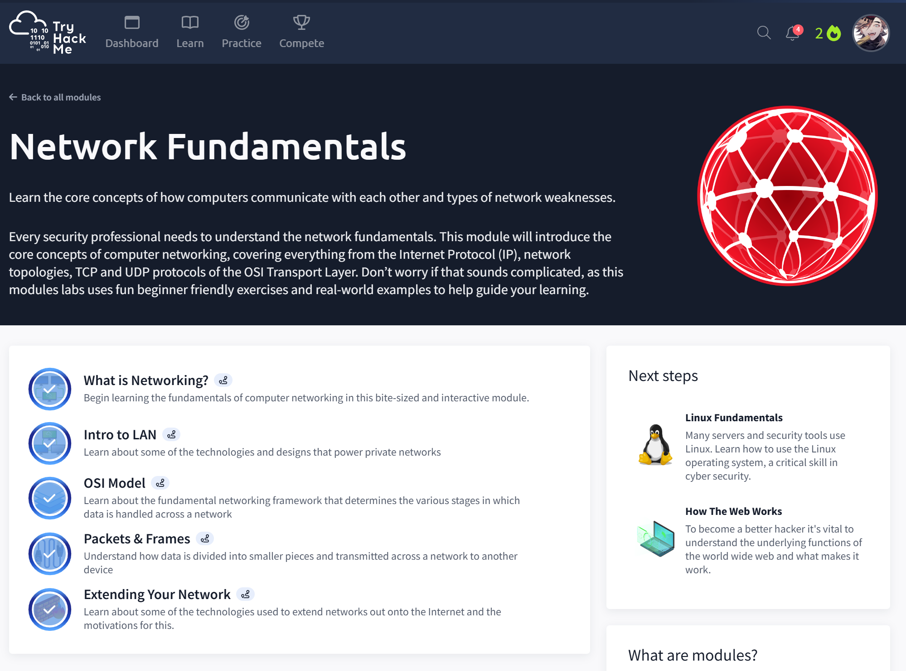

# Network Fundamentals
## Completed: Sept 5, 2025
  

### Objective
- Learn the basics of how computers can communicate in networks.
- Understand how data moves from device to device and the structure of a network.

### Key Point  Learned
- A network is multiple devices connected together to share data.
- LANs (Local Area Networks) connect computers in a small area, like a home or an office.
-  The OSI Model explains how data travels through 7 layers.
-  Packets and frames are data broken into smaller chunks to move across the network.
-  Networks can be extended further as the Internet.

### Skills Gained
- I can successfully explain what a network is and why it is so effective in cybersecurity.
- Identify the differences between LAN and WAN.
- Understand the importance of the OSI model for troubleshooting and its usage.
- Describe how data is packaged into, from packets to frames.

### Screenshot

