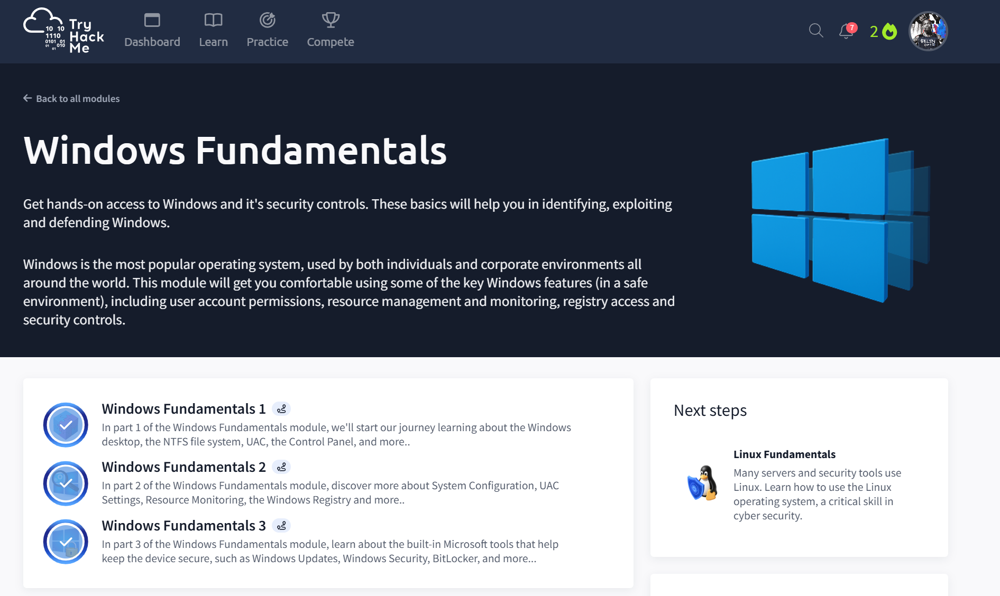

# Windows Fundamentals
## Completed: Oct 2, 2025

### Objective
- This module assists me by building a functional understanding of the Windows operating system and its built-in features.
- I learned how Windows can manage files, user permissions, system configuration, and security settings, and these are all essential for both defending and exploiting in the Windows environment.

### Key Point Learned
- Windows Environment: I get to explore the core components of Windows interface, including the desktop, Control Panel, and NTFS file system in order to understand how the operating system is organized and how users can interact with it.
- System Configuration & Registry: Windows systems uses the Registry and configuration tools to control settings and behavior, which can be very useful for both troubleshooting and identifying potential threats or weaknesses.
- User Access and Permissions: I found how Windows manages accounts, privileges, and the User Account Control in order to prevent unauthorized actions. This can be a key part of the system security.
- Security Features: Throughout the virtual machine, I explored built-in security tools like Windows Defender, BitLocker, and Windows Update. This experiment resulting me to understanding how they protect systems from malware and unauthorized access.
- Monitoring and Resource Management: During the lesson, tools like Task Manager and Resource Monitor are introduced, and these tools can keep track of running processes and system performance, which can reveal any abnormal activity.

### Skills Gained
- Navigating and Configuring core Windows systems settings with ease.
- Understood how Windows permissions and UAC can greatly enhance security.
- Using System monitoring tools can detect unusual behavior and regulate norms.
- Applying knwoledge from Windows Registry and configuration when come to troubleshooting and analysis.
- Gained hands-on experience with the native Windows securty tools for both defensive and investigative path in the future.

 
